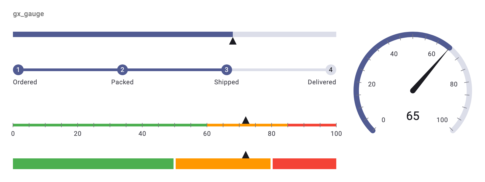
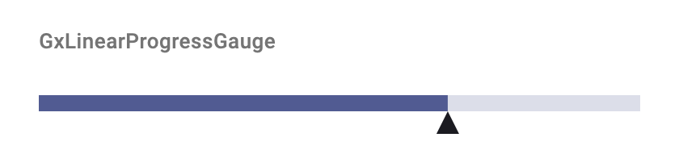
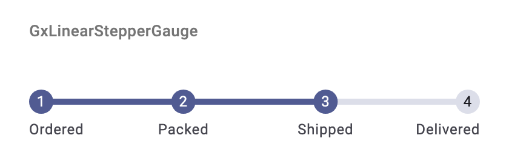
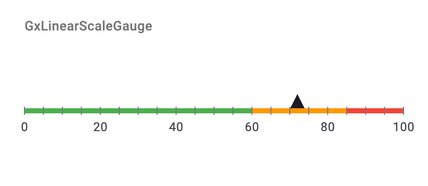
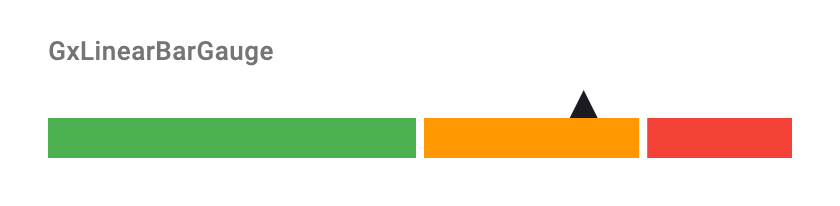
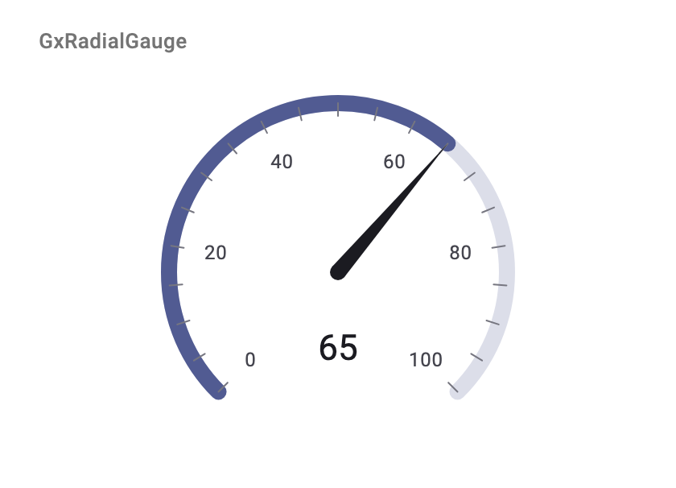
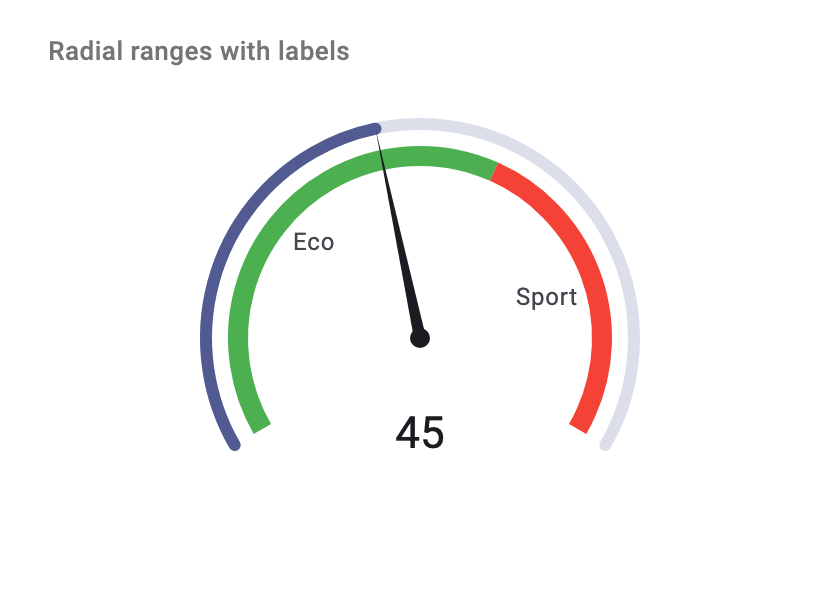
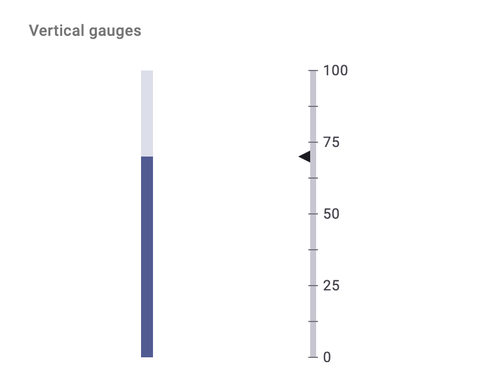

# gx_gauge

Customizable, animated and accessible gauges for Flutter: linear progress, stepper, scale and bar gauges, plus a radial gauge.

[](https://pub.dev/packages/gx_gauge)
[](LICENSE)



## Features

- **Five gauges:** `GxLinearProgressGauge`, `GxLinearStepperGauge`, `GxLinearScaleGauge`, `GxLinearBarGauge` and `GxRadialGauge`.
- **Animated:** pass a `duration` and `curve`, and value changes animate smoothly, like `AnimatedContainer`.
- **Interactive:** add `onChanged` to turn a gauge into a slider, or a radial gauge into a knob.
- **Ranges, needles, markers and labels,** including gradients and fully custom needle painting.
- **Horizontal or vertical,** and mirrored automatically in right-to-left locales.
- **Theme-aware:** colors you don't set come from your `ColorScheme`, so dark mode just works.
- **Accessible:** screen readers announce each gauge's label and value.
- **No dependencies** beyond Flutter.

## Install

```sh
flutter pub add gx_gauge
```

```dart
import 'package:gx_gauge/gx_gauge.dart';
```

Requires Flutter 3.47 or later.

## Quick start

Every gauge takes a `GxGaugeValue(value:, min:, max:)` (the range defaults to 0–100). Linear gauges fill the available width, and a radial gauge fills the shortest side unless you give it a `diameter`.

### Linear progress



```dart
const GxLinearProgressGauge(
  value: GxGaugeValue(value: 68),
  needle: GxLinearNeedle(
    shape: GxNeedleShape.triangle,
    position: GxNeedlePosition.bottom,
    size: Size(14, 14),
  ),
)
```

### Stepper



```dart
const GxLinearStepperGauge(
  currentStep: 2,
  steps: <GxStepperStep>[
    GxStepperStep(label: GxGaugeLabel(label: 'Ordered')),
    GxStepperStep(label: GxGaugeLabel(label: 'Packed')),
    GxStepperStep(label: GxGaugeLabel(label: 'Shipped')),
    GxStepperStep(label: GxGaugeLabel(label: 'Delivered')),
  ],
)
```

### Scale



```dart
const GxLinearScaleGauge(
  value: GxGaugeValue(value: 72),
  interval: 20,
  minorTicksPerInterval: 3,
  needle: GxLinearNeedle(
    shape: GxNeedleShape.triangle,
    position: GxNeedlePosition.top,
    size: Size(14, 14),
  ),
  ranges: <GxLinearRange>[
    GxLinearRange(start: 0, end: 60, color: Colors.green),
    GxLinearRange(start: 60, end: 85, color: Colors.orange),
    GxLinearRange(start: 85, end: 100, color: Colors.red),
  ],
)
```

### Bar



```dart
const GxLinearBarGauge(
  value: GxGaugeValue(value: 72),
  gapBetweenBars: 4,
  bars: <GxLinearBarPointer>[
    GxLinearBarPointer(start: 0, end: 50, color: Colors.green),
    GxLinearBarPointer(start: 50, end: 80, color: Colors.orange),
    GxLinearBarPointer(start: 80, end: 100, color: Colors.red),
  ],
  needle: GxLinearNeedle(
    shape: GxNeedleShape.triangle,
    position: GxNeedlePosition.top,
    size: Size(14, 14),
  ),
)
```

### Radial



```dart
const GxRadialGauge(
  value: GxGaugeValue(value: 65),
  diameter: 220,
  startAngleInDegree: 135,
  sweepAngleInDegree: 270,
  interval: 20,
  showMajorTicks: true,
  showMinorTicks: true,
  minorTicksPerInterval: 3,
  showLabels: true,
  showNeedle: true,
  needle: GxRadialNeedle(),
)
```

Angles are in degrees, clockwise from 3 o'clock.

## Recipes

### Ranges with labels



```dart
const GxRadialGauge(
  value: GxGaugeValue(value: 45),
  diameter: 220,
  startAngleInDegree: 150,
  sweepAngleInDegree: 240,
  style: GxRadialGaugeStyle(thickness: 6),
  showNeedle: true,
  needle: GxRadialNeedle(thickness: 6),
  ranges: <GxRadialRange>[
    GxRadialRange(start: 0, end: 60, offset: -16, color: Colors.green,
        label: GxGaugeLabel(label: 'Eco')),
    GxRadialRange(start: 60, end: 100, offset: -16, color: Colors.red,
        label: GxGaugeLabel(label: 'Sport')),
  ],
)
```

Linear scales take `GxLinearRange`s the same way. Bars and ranges also accept a `shaderCallback` (for gradients) and a `borderColor`.

### Animation

Every gauge animates value changes once you give it a `duration`. An update that arrives mid-animation continues smoothly from the value on screen.

```dart
GxRadialGauge(
  value: GxGaugeValue(value: speed, max: 240),
  duration: const Duration(milliseconds: 600),
  curve: Curves.easeOutCubic,
)
```

### Interaction

Add `onChanged` to let users tap or drag a gauge to set its value. The radial gauge works like a knob. Interactive gauges can also be adjusted with screen readers.

```dart
GxRadialGauge(
  value: GxGaugeValue(value: _volume),
  semanticLabel: 'Volume',
  onChanged: (double v) => setState(() => _volume = v),
)
```

The progress, scale and bar gauges take `onChanged` too, and the stepper reports taps with `onStepTapped`.

### Vertical gauges



```dart
const GxLinearProgressGauge(
  value: GxGaugeValue(value: 70),
  direction: Axis.vertical,
)
```

All four linear gauges accept `direction: Axis.vertical`, and run bottom to top.

### Custom needles

Set the needle's shape to `GxNeedleShape.custom` and draw it yourself. The painter receives the needle, with its color already resolved.

```dart
void drawPin(Canvas canvas, Offset anchor, GxLinearNeedle needle) {
  final Paint paint = Paint()..color = needle.color!;
  canvas.drawCircle(anchor, needle.size.width / 2, paint);
}

const GxLinearScaleGauge(
  value: GxGaugeValue(value: 40),
  needle: GxLinearNeedle(shape: GxNeedleShape.custom, size: Size(12, 12)),
  needlePainter: drawPin,
)
```

Pass a top-level or static function so the gauge doesn't repaint every time its parent rebuilds.

### Theming

Colors you leave unset come from the ambient `Theme`. For example, `primary` fills progress and arcs, `outline` colors ticks, and `onSurface` colors needles. To pin a color, set it on the style:

```dart
const GxLinearProgressGauge(
  value: GxGaugeValue(value: 40),
  style: GxLinearProgressStyle(
    color: Colors.deepPurple,
    backgroundColor: Colors.black12,
  ),
)
```

### Accessibility

Each gauge announces its value to screen readers. Add a `semanticLabel`, e.g. `'Battery'`, and optionally a `semanticValueFormatter`, e.g. `(v) => '${v.round()} percent'`.

## Migrating from girix_code_gauge

This package was previously published as [`girix_code_gauge`](https://pub.dev/packages/girix_code_gauge). Every type now has the `Gx` prefix, and a few APIs have changed. [doc/MIGRATION.md](doc/MIGRATION.md) lists every change, with before-and-after code.

## More

- [API reference](https://pub.dev/documentation/gx_gauge/latest/): every class and parameter, with defaults.
- [Example app](example/): `lib/main.dart` is a minimal demo, and `lib/showcase/` covers every option.
- [Changelog](CHANGELOG.md)
- [Contributing](CONTRIBUTING.md)
- [MIT License](LICENSE)
